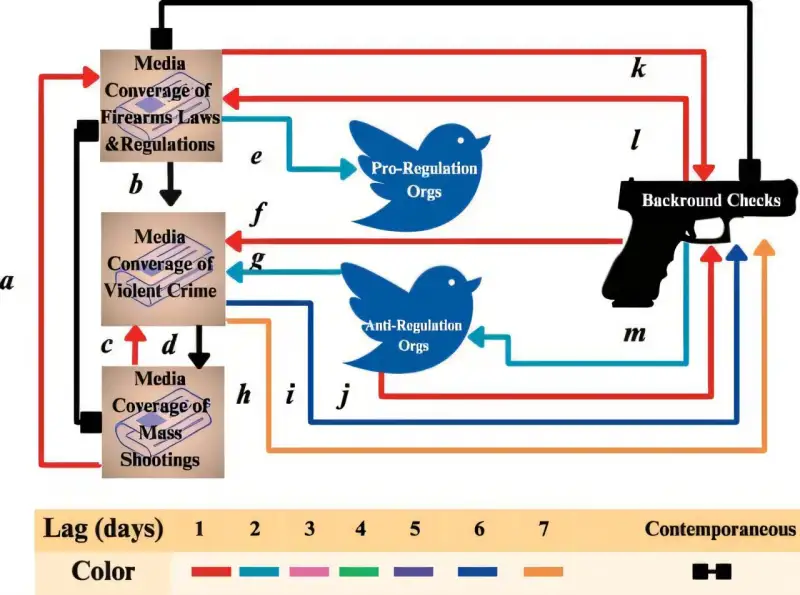

### Kevin Slote 👋

<!--
**kslote1/kslote1** is a ✨ _special_ ✨ repository because its `README.md` (this file) appears on your GitHub profile.

Here are some ideas to get you started:

- 🔭 I’m currently working on ...
- 🌱 I’m currently learning ...
- 👯 I’m looking to collaborate on ...
- 🤔 I’m looking for help with ...
- 💬 Ask me about ...
- 📫 How to reach me: ...
- 😄 Pronouns: ...
- ⚡ Fun fact: ...
-->

Kevin Slote is a principal Data Scientist. I have a Pd.D. in Applied Mathematics and Master's degree in abstract algebra, I have a passion for category theory and topological data analysis. I completed my Ph.D. in the Biological and Engineering Networks Lab, and I strives to deepen his understanding of applied mathematics and neuroscience. My research explores the prediction of epilepsy through the examination of complex neuronal networks, and casual statistical modelling. I am currently doing Postdoctoal research at Clarkson University.

* [Kevin Slote **:godmode:**](https://kslote1.github.io/)

* [Kevin Slote Teaching Page :link:](https://sites.google.com/view/kevin-slote)

* [Blue Sky](https://app.bsky.cz/profile/did:plc:kkyydu6asmal4et5k7w2smwr)
  
* [Biological and Engineering Networks Lab](https://math.gsu.edu/ibelykh/belykh_lab.html)

# Join my reading group on Data-Driven Dynamical Systems!
GitHub link posted below for [data driven dynamics and machine learning](https://github.com/kslote1/Data-Driven-Dynamics)

# Media Mentions

# New Patent Awarded

